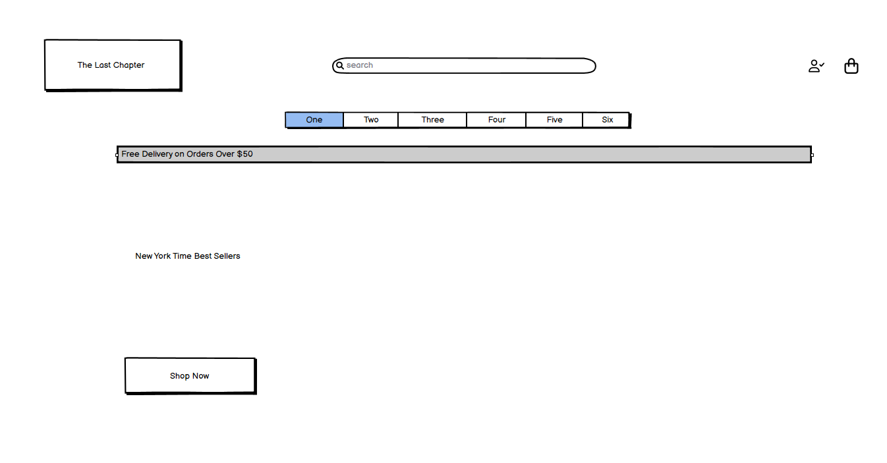
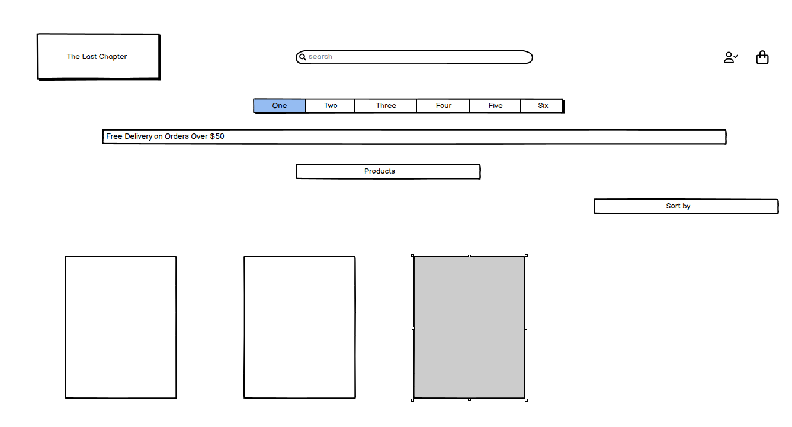
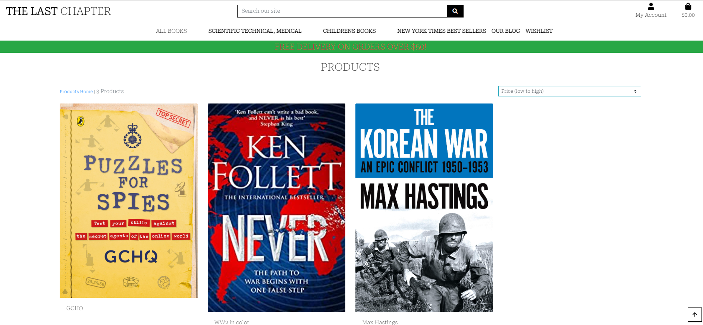
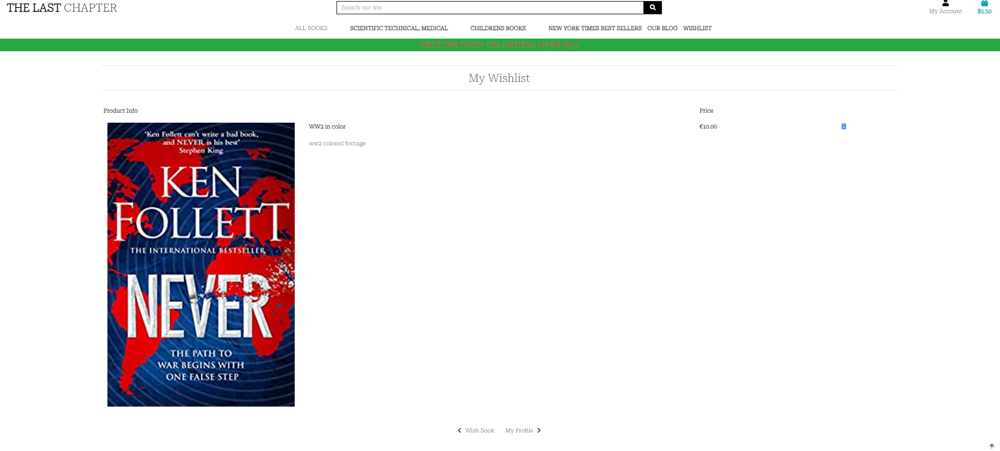
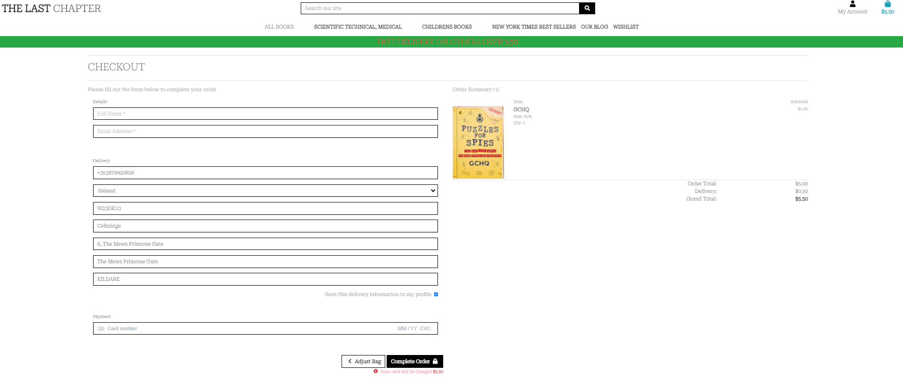
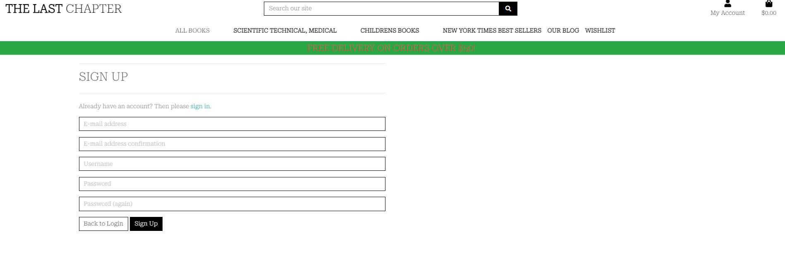
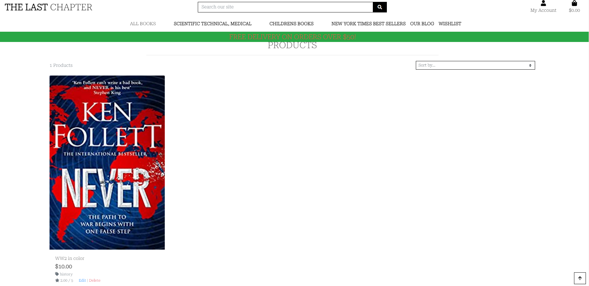
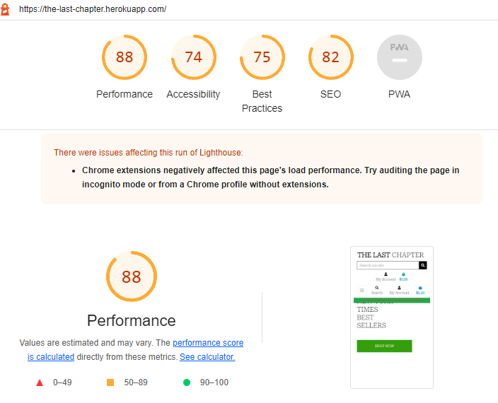
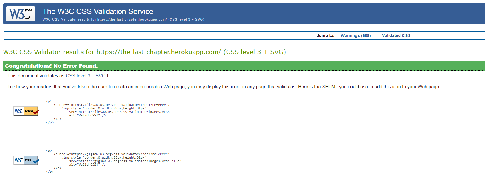

# Table of Contents
- [Table of Contents](#table-of-contents)
  - [Introduction](#introduction)
  - [UX](#ux)
    - [User Stories](#user-stories)
    - [Strategy](#strategy)
    - [Scope](#scope)
  - [Typography](#typography)
  - [Color](#color)
  - [Structure](#structure)
    - [Skeleton](#skeleton)
    - [Wireframes](#wireframes)
    - [Mobile](#mobile)
    - [Desktop](#desktop)
  - [Database Schema](#database-schema)
  - [Features](#features)
    - [Existing Features (Photo Links)](#existing-features-photo-links)
      - [Navbar](#navbar)
      - [Homepage](#homepage)
      - [Footer](#footer)
      - [Pay form Page](#pay-form-page)
      - [Register as a User](#register-as-a-user)
      - [Product Page](#product-page)
      - [404 Page](#404-page)
    - [Future Features](#future-features)
      - [Model of payment based on subscriptions](#model-of-payment-based-on-subscriptions)
      - [Chat window](#chat-window)
      - [Wishlist](#wishlist)
  - [SEO](#seo)
  - [Social Media](#social-media)
  - [Email Marketing](#email-marketing)
  - [Testing](#testing)
    - [Testing User Stories from User Experience (UX) Section](#testing-user-stories-from-user-experience-ux-section)
      - [robots.txt](#robotstxt)
      - [sitemap.xml](#sitemapxml)
      - [Functionality Testing](#functionality-testing)
  - [Deployment](#deployment)
      - [Deploy to Heroku](#deploy-to-heroku)
  - [Credits](#credits)
      - [Media](#media)
      - [Code](#code)
      - [Programming Languages](#programming-languages)
      - [Payments](#payments)
      - [Frameworks, Libraries \& Programs Used](#frameworks-libraries--programs-used)
      - [Acknowledgements](#acknowledgements)

**[LIVE DEMO - https://the-last-chapter.herokuapp.com

*

## Introduction
The Last Chapter is an book retailer best known for selling books, stationery, cards, gifts. I used an double entendre as this would be my "Last Chapter" with Code Institute 
The inspiration of the website came from my visit to Bucharest Romania and saw an old man selling old books on the sidewalk of a main street, I stoped and had a browse and I was impressed by the huge selection of old books, I tought that he could have a cool website for old vintage books. 
Unfornutely I cannot finish this project on time so my first submision is of a incomplete project that im still working on . The whole project is based on Code Institute Boutique Ado with the intent of adding my own apps and features making it an online bookstore and office supplies. 
My second attempt to finish the project for the deadline is a semi-failure in my opinion 
Note:

## UX

  ### User Stories

  User story format/steps has been taken from Boutique Ado and imported from Repository ecommerce2 (a test for my project) and more issues have been resolved manually during the project.
  
  -Account Creation</a>

- VIEWING AND NAVIGATION
  - As a shopper, I want to view items in my bag to be purchased so I can identify the total cost of my purchase and all items I will receive.</a>
  - As a shopper, I want to view orders and confirmation after checkout so I can verify that I haven't made any mistakes.</a>
  
- REGISTRATION AND USER ACCOUNTS
  - As a user, I want easily register for an account so I can have personal account information.</a>
  - As a user, I want to easily recover my password in case I forgot it so I can recover access to my account.</a>
  - Log In / Log Out  As a user,   I want to easily log in or log out so I can access my personal account details.</a>
  - As a shopper, I can change my account user details(name) so I can pay with another card without problems.</a>
  - >As a shopper, I can delete my account and details if I don't want to use the website or if my details to not kept in the database.</a>
  - As a Shopper, I can receive an email of confirmation when I am resetting my password so that I know that my new password is active and has been changed successfully.</a>
  - As a user, I want to have a personalized user profile so I can view my personal order history and order confirmations and save my payment information.</a>
  - As a shopper, I want to receive an email confirmation after checking out so I can keep the confirmation of what I've purchase for my records.</a>
    
- SORTING AND SEARCHING
  - As a shopper, I can choose the category that I want to see and the group of products I am interested <a>
  - As a shopper, I want to sort the list of available products so I can easily categorically sort products.</a>
  
- PURCHASING AND CHECKOUT
  - As a shopper, I want to adjust the number of individual items in my bag so I can easily make changes to my purchase before checking out.</a>
  - As a shopper, I can delete items from my basket so that I can buy only the items that I need.</a>
  - As a shopper I can press the delete button so that I can have the final price after I had deleted an item in my cart/basket.</a>
  
- ADMIN AND STORE MANAGEMENT
  - As a site owner, I want to add a product so I can add new items to my store.</a>
  - As a store owner, I want to edit/update a product so I can change product prices, descriptions, images, and other product criteria.</a>
  - As a shop owner, I want to delete a product so I can remove items that is no longer for sale.</a>
   
  
  ### Strategy

  - This is a website where users can find old books and office supplies : 
  - Users that are passionate readers :
   ### Scope
   - The website provides for the user an easy navigation , photos,content,filter and prices with regards the books.

## Typography
 - For typography has been used <a href=https://fonts.google.com/specimen/Roboto
 target='_blank'> Google Fonts Roboto</a>

 ## Structure
 ### Skeleton

   ### Wireframes 
  - Wireframes created with Balsamiq
  

  

  

  

   ### Mobile

   ### Desktop

## Database Schema

  

## Features

  
   ### Existing Features

   #### Navbar

   
  
   #### Homepage

   

   #### Wishlist
   

   #### Checkout Page
   

   #### Register as a User

  

   #### Product Page
 

   #### 404 Page
   Due to time restrections I wouldnt be able to add a 404 page in time for my submmision , I will add one after

   ### Future Features 

   #### Model of payment based on subscriptions

   #### Chat window
   #### SEO
   #### Social Media
   #### Email Marketing 
   ##### robots.txt
   ##### sitemap.xml  

  ## Testing

  The project was manually tested by following the steps :
  - Code was run trough the validator resulting no issues
  - Deploying the project from gitpod workspace trough Heroku
  - The site was also tested on I-Pad , I-Phone and Laptop.
  
  ### Testing User Stories from User Experience (UX) Section

  - All user stories in the list above has been tested and confirmed after implementation.
   
  #### robots.txt
   -  
  #### sitemap.xml  
   -  
  
  #### Functionality Testing

  * Lighthouse

    

  * HTML

  * CSS
    

  * PEP8 
  

  ## Deployment

  Local Deployment

  Running locally
* Log in to GitHub and locate the Repository for this site.
* Under the repository name, above the list of files, click "Code".
* Here you can either Clone or Download the repository.
* You should clone the repository using HTTPS, clicking on the icon to copy the link.
* Open Git Bash.
* Change the current working directory to the new location, where you want the cloned directory to be.
* Type git clone, and then paste the URL that was copied in Step 4.
* Press Enter, and your local clone will be created.
* You will also need to install all of the project requirements. This can be done using the command pip3 install -r requirements.txt.
* Type python3 app.py in your GitPod terminal to run your local site of this project.

  #### Deploy to Heroku

    Deployment
The website of this project requires back-end technologies such as server, application, and database so the website is deployed on Heroku, which is a cloud platform with a service supporting several programming languages, because GitHub can only host a static websites.
Before deploying the website to Heroku, there are three important steps to follow to make the application work in Heroku correctly.
* Create requirements.txt file that contains the names of packages being used in Python. It is important to update the file if other packages or modules are installed during the project.
* Create Procfile that contains the name of the application file so that Heroku knows what to run.
* Push them into GitHub.
* Once above steps have been followed the website can be deployed. Please find the steps of the deployment in Heroku:
* Create an account in Heroku
* Click New & Create new app to create a new app
* Put an app name, which must be unique, choose a region and click create app
* Go to Deploy section and click Connect to GithHub
* Search for the repository by the repository name and connect it
* Before clicking Enable Automatic Deploys, hidden variables such as IP address, PORT, SECRET_KEY need to be recorded in Heroku. Go to Settings, click 'Reveal config vars' and fill out necessary keys and values.
* Once all the hidden variables are recorded, then click Enable Automatic Deploys and click Deploy Branch (Main should be selected unless you want other branches to be deployed).
* When the app is deployed by Heroku correctly, there is a confirmation message and you can access the app.

## Credits

Code Institute Boutique Ado walkhtrough

  #### Media

   - All images for the book  have been taken from  http://www.amazon.com
   - Cover image for the site has been taken from  https://www.centracare.com
   - All description content for the books has been taken from https://books.google.ie/books/about/

  #### Code 

   - Through this project, I relied heavily on tutorials and Bootstrap examples.

   - Code Institute Boutique Ado and Very Academy on Youtube

   - I found this bookstore walkthrough to be brilliant. I found it extremely helpful for making Django sites more dynamic. As a result of this tutorial, I learned how to make AJAX calls. I also learned a lot about database design and setting up a Stripe webhook.

   - [Codegrepper](https://www.codegrepper.com/code-examples/python/jinja+get+current+url+django) as a general resource.

   - [W3School](https://www.w3schools.com/) as a general resource.

  #### Programming Languages 

  - Python
  - HTML
  - CSS
  - JavaScript
  

  #### Payments

  - Payment functionality was implemented using the Stripe system. The system was set up using the Boutique Ado project and Stripe documentation.

  - For testing the payment system, the following dummy details can be used: Card number: 4242 4242 4242 4242 Expiry: 04/24 CVC: 242

  - No auth: 4242424242424242

  - Auth: 4000002500003155

  - Error: 4000000000009995

  
  #### Frameworks, Libraries & Programs Used

  - [Balsamiq](https://balsamiq.cloud/) - Was used to create the wireframes
  - [Bootstrap](https://getbootstrap.com/) - Was used to contribute to responsiveness and styling of the site
  - [TinyJPG](https://tinyjpg.com/) - Was used to compress images before uploading
  - [GitHub](https://github.com/) - Holds the repository of my project, GitHub connects to GitPod and Heroku
  - [GitPod](https://gitpod.io/) - Connected to GitHub, GitPod hosted the coding space,
   allowing the project to be built and then committed to the GitHub repository.
  - [Heroku](https://heroku.com/) - Connected to the GitHub repository, Heroku is a cloud application platform used 
   to deploy this project so the backend language can be utilised/tested.
  - [Django](https://www.djangoproject.com/) - This framework was used to build the foundations of this project
  - [Gunicorn](https://gunicorn.org/) - Gunicorn is a pure-Python HTTP server for WSGI applications.
  - [Cloudinary](https://cloudinary.com/) - Used to store images online for the recipe posts.
   a list of ingredients and method steps.
  - [GoogleFonts](https://fonts.google.com/) - Provide fonts for the website.
  - [FontAwesome](https://fontawesome.com/) - Was used for icons.
  - [AmIResponsive](https://ui.dev/amiresponsive) - To check if the site is responsive on different screen sizes.
  - [W3CMarkupValidator](https://jigsaw.w3.org/) - Was used to validate HTML.
  - [Colors](https://color-hex.org/) - To make color palette

 
  #### Acknowledgements

 Huge Thank you to Andrew Dempsey an absolute gentleman 